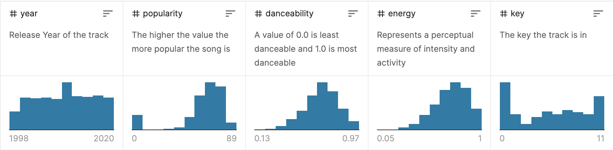

# Задача - анализ csv файла "Top Hits Spotify"

### Цели

* Работа с кодом Java SE, Spring Boot
* Понимание анализа и статистики данных.
* Понимание постановки задачи в заданных рамках, работа с публичной документацией.
* Работа с HTTP API, JSON.
* Инструменты для CI/CD
* Документирование

Файл `songs_normalize.csv` содержит единственную таблицу (датасет) с 2К записей по данным стримингового сервиса Spotify за 2000-2019 годы. 
Датасет находится в публичном доступе. Детальное описание датасета находится здесь - https://www.kaggle.com/datasets/paradisejoy/top-hits-spotify-from-20002019

Нужно реализовать HTTP API для статистического анализа данных датасета (csv файл).

Реализация с использованием **Java SE 11** и **Spring Boot**, остальные библиотеки и зависимости на усмотрение разработчика.

Сборка и запуск проекта с использованием **Gradle**.

## Серверная часть

Принимает запрос клиента по HTTP API, разбирает csv файл и отдает результат в виде JSON.

**Вызов API GET принимает два параметра** 

* colname (обязательный) - название столбца, для которого рассчитывается статистика.
* year (необязательный) - если параметр передан, данные должны быть отфильтрованы по столбцу `year`. Если нет - фильтр не применяется.


```
http://localhost:8080/?year=2000
```

**В результате будет рассчитана статистика полей по децилям. Статистика может расчитываться для следующих полей.**

* duration_ms
* year
* popularity
* danceability
* energy
* key


API возвращает массив JSON из десяти метрик (децилей). 

```
[
    {"min" : 0, "max" : 100, "count" : 10},
    {"min" : 101, "max" : 200, "count" : 20},
    {"min" : 201, "max" : 999, "count" : 30},
    ...
]
```

По сути нужно сделать разбивку всех (отсортированых по возрастанию) значений столбца на десять групп с подсчетом максимума/минимума и количества в каждой группе.
 
Определение децилей можно найти здесь - https://math.semestr.ru/group/deciles.php  

На странице описания данных вы можете посмотреть как выглядят уже рассчитанные метрики для данного датасета - https://www.kaggle.com/datasets/paradisejoy/top-hits-spotify-from-20002019

Если что-то пошло не так, это может служить вам референсом.



## /etc

Результатом задания является ссылка на публичный github репозиторий.

Репозиторий должен содержать проект с исходниками, готовыми к сборке и запуску в dev окружении.

Должен быть общий **README.md** с инструкциями по сборке и запуску. Ручная установка зависимостей недопустима.

По желанию проект может собираться в один **Docker** контейнер, в таком случае должен быть подготовлен файл сборки контейнера, рекомендуется использовать базовый образ `alpine-openjdk-11`.
